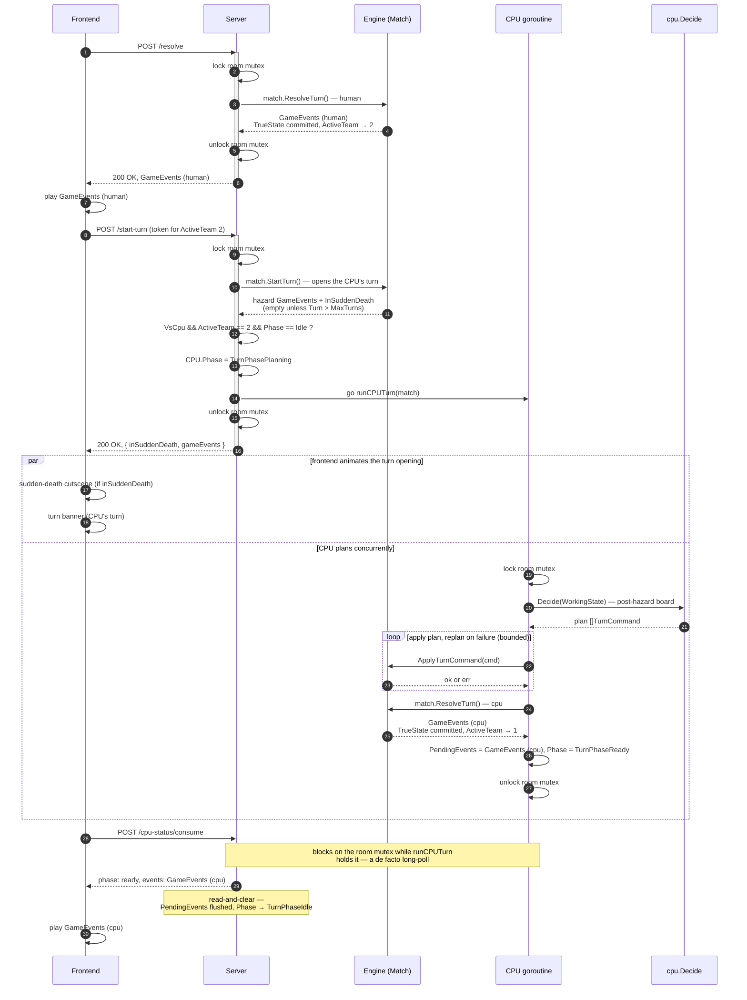
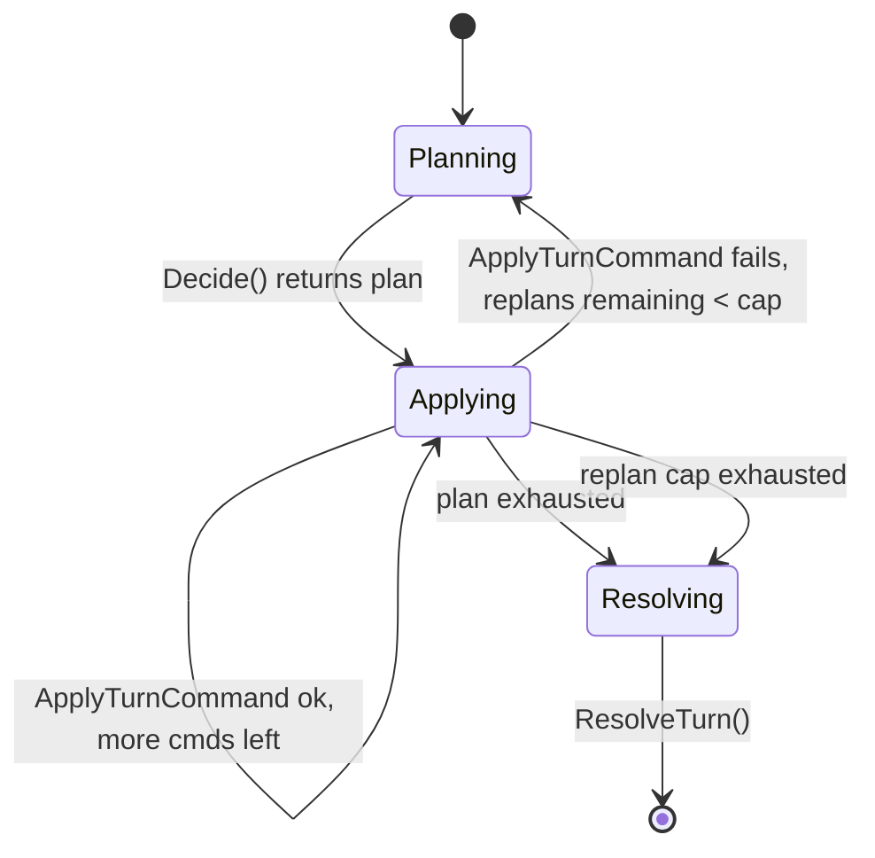

# VS-CPU Turn Sequence

Who calls `ResolveTurn()`, when, and what each layer is doing while the other two think it's their turn.

## What's actually happening at each layer

1. `ResolveTurn()` runs twice, but never concurrently with itself — the calls sit inside the same room mutex, never overlapping in wall-clock time. The human call fully commits `TrueState` and releases the lock before the goroutine is ever scheduled, so the goroutine reads the human's committed result, not a stale copy.
2. The CPU's turn opens exactly like the human's, through `POST /start-turn`. Sudden-death injection lives only in `Match.StartTurn()`, so launching the goroutine from anywhere earlier would have `Decide()` planning against a board missing that turn's hazards. `Phase` must flip to `TurnPhasePlanning` before the mutex unlocks — otherwise a poll landing between unlock and goroutine-start reads a stale `TurnPhaseIdle` and the frontend thinks there's nothing to wait for. The `Phase == TurnPhaseIdle` guard keeps a repeated `/start-turn` from launching a second goroutine.
3. The client holds both player tokens and selects by `ActiveTeam`, so it authenticates the CPU's `/start-turn` with team 2's token under the existing rule — no relaxation, and `StartTurnResponse` is identical on both paths.
4. Frontend flow: animate `GameEvents (human)` → `/start-turn` → animate hazards and banner → `/cpu-status/consume` → animate `GameEvents (cpu)`. The poll blocks on the room mutex for the CPU turn's duration rather than returning `phase: planning`, so a "CPU is thinking" state renders from request dispatch, not from a `planning` response.
5. `cpu.Decide()` is called once per turn and returns a full plan, not one command at a time — `runCPUTurn` applies it mechanically. `cpu` never pre-validates the plan against engine rules; `ApplyTurnCommand` is the sole authority. A failed apply mid-plan re-invokes `Decide()` against the now-current `WorkingState` for the remaining scope (bounded retries), rather than aborting outright or blindly continuing. See [Technical Design Spec §10](../design.md#10-vs-cpu) for the full rationale.
6. `/cpu-status/consume` is `POST`, not `GET`: it read-and-clears `PendingEvents` on every call, breaking GET's idempotency guarantee. Upgrade path: an append-only event journal, decoupled from this mailbox and never cleared, would let a non-destructive `GET /cpu-status` return alongside it — swap method/route, drop the clear, no other change needed.

## CPU Plan Execution & Replan

The control-flow inside the "CPU plans concurrently" branch above, as a state machine:

