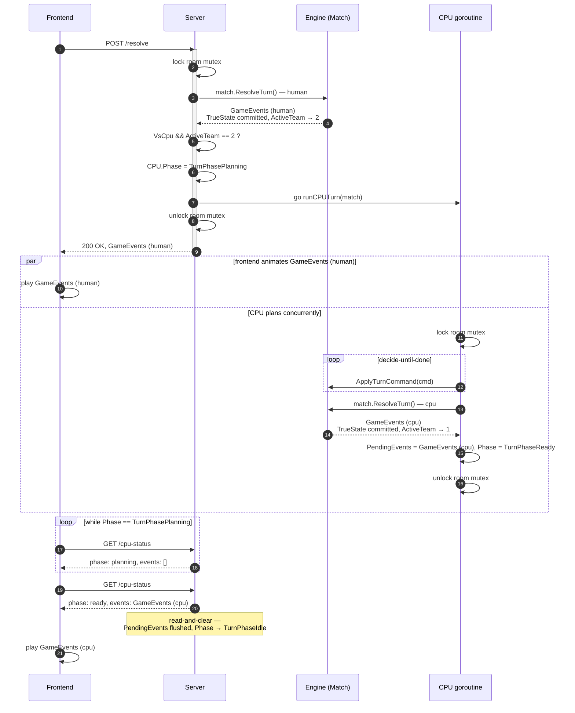

# VS-CPU Turn Sequence

Who calls `ResolveTurn()`, when, and what each layer is doing while the other two think it's their turn.

## What's actually happening at each layer

1. `ResolveTurn()` runs twice, but never concurrently with itself — both calls sit inside the same room mutex, one right after the other, never overlapping in wall-clock time. The human call fully commits `TrueState` and releases the lock before the goroutine ever gets scheduled, so when the goroutine locks and reads state, it's reading the human's committed result, not a stale copy.
2. The server doesn't "resolve" anything itself — its whole job here is locking, delegating both `ResolveTurn()` calls to the engine, and deciding once whether to launch the goroutine. That decision has to be made and `Phase` flipped to `TurnPhasePlanning` before the mutex unlocks — otherwise a poll landing between unlock and goroutine-start could read a stale `TurnPhaseIdle` and the frontend would think there's nothing to wait for.
3. Frontend flow: animate `GameEvents (human)` → poll `/cpu-status` until `TurnPhaseReady` → animate `GameEvents (cpu)`. The poll loop and the animation run side by side; CPU thinking time is only visible if it outlasts the animation.
